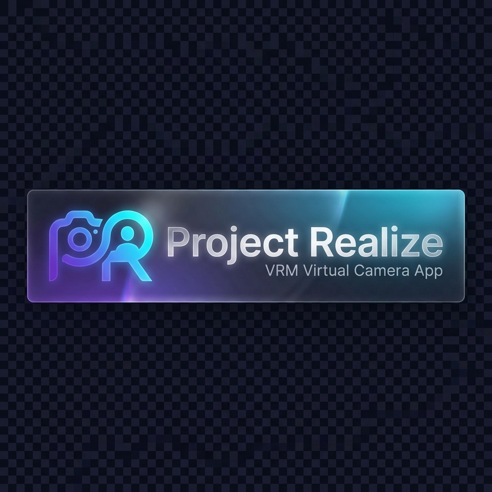

<h1 align="center">
  <br>
  Realize
</h1>

<p align="center">
  <strong>VRMモデルをバーチャルカメラとして配信できるデスクトップアプリ</strong><br>
  Zoom / Teams / Google Meet / OBS などで3Dアバターを使用可能
</p>

<p align="center">
  
  
  
  
</p>

<p align="center">
  <strong>「カメラ不要。トラッキングなし。だから軽い」</strong>
</p>

<p align="center">
  🚫 Webカメラ不要 → 姿勢推定なしで超軽量<br>
  🚫 OBS二重起動不要 → 単体で仮想カメラ出力<br>
  ✨ 勝手に可愛く動く → リップシンク＆自動表情でノータッチ
</p>

---

## ✨ 特徴

- **🎭 VRMモデル対応** - VRM形式の3Dアバターをドラッグ&ドロップで読み込み
- **🎥 仮想カメラ出力** - OBS Virtual Camera経由でZoom/Teams/Meetに直接配信
- **🎤 リアルタイムリップシンク** - マイク入力に同期した口パク
- **😊 自動表情切り替え** - ランダムで表情が自然に変化（通常・笑顔・リラックス等）
- **💃 VRMAアニメーション** - 外部アニメーションファイル(.vrma)に対応
- **🖼️ 背景カスタマイズ** - 画像・動画・グリーンバック対応
- **📷 カメラプリセット** - バストアップ・全身・顔アップ + カスタム位置記憶
- **🎨 色調補正** - 明るさ・コントラスト・彩度を調整
- **🌐 多言語対応** - 日本語・英語・中国語・韓国語
- **🎬 FPS表示** - リアルタイムフレームレート監視
- **💾 設定の永続化** - 起動時に前回の状態を自動復元

---

## 🚀 クイックスタート

### 必要環境

- Node.js 18+
- Python 3.10+（仮想カメラ用）
- OBS Studio（仮想カメラドライバ）

### インストール

```bash
# 依存関係のインストール
npm install

# Python仮想カメラブリッジの準備
pip install pyvirtualcam opencv-python numpy
```

### 開発

```bash
npm run dev
```

### ビルド

```bash
# Windows
npm run build:win

# macOS
npm run build:mac

# Linux
npm run build:linux
```

---

## 🎮 使い方

### 1. VRMモデルの読み込み
起動後、VRMファイルをウィンドウにドラッグ&ドロップ

### 2. カメラ位置の調整
- **プリセット**: バストアップ / 全身 / 顔アップ から選択
- **マウス操作**: 左ドラッグで回転、中ドラッグで移動、スクロールでズーム
- **記憶**: 調整した位置を「記憶」ボタンで保存

### 3. リップシンクの設定
- マイクを選択してONにするとリアルタイムで口が動く

### 4. 仮想カメラ配信
1. **OBSで一度「仮想カメラ開始」→「停止」を実行**（初回のみ）
2. Realizeで「仮想カメラ起動」をクリック
3. Zoom等で「OBS Virtual Camera」を選択

---

## 🎨 UIテーマ

ウィンドウ右上のボタンで4種類のテーマを切り替え可能:

| テーマ | 説明 |
|--------|------|
| 🥃 **Dark Rum** | 落ち着いたダークブラウン（デフォルト） |
| 🍶 **White Liquor** | クリーンなライトモード |
| 🍷 **Wine Red** | エレガントなワインレッド |
| 🥃 **Sherry Cask** | 温かみのあるシェリー樽カラー |

---

## 📁 プロジェクト構成

```
realize/
├── src/
│   ├── main/           # Electronメインプロセス
│   ├── preload/        # プリロードスクリプト
│   └── renderer/       # Reactフロントエンド
│       └── src/
│           ├── components/
│           │   ├── VRMViewer.tsx  # Three.js + VRM描画
│           │   ├── Controls.tsx   # 操作パネル
│           │   └── DropZone.tsx   # ファイルドロップ
│           ├── i18n/              # 多言語翻訳
│           └── App.tsx            # メインアプリ
├── scripts/
│   └── virtual_camera_bridge.py   # Python仮想カメラブリッジ
└── resources/                      # アプリアイコン等
```

---

## 🛠️ 技術スタック

| カテゴリ | 技術 |
|----------|------|
| フレームワーク | Electron + Vite |
| UI | React 18 + TypeScript |
| 3D描画 | Three.js + @react-three/fiber |
| VRM処理 | @pixiv/three-vrm |
| 仮想カメラ | pyvirtualcam (Python) |
| スタイリング | Vanilla CSS (Glassmorphism) |

---

## 📄 ライセンス

MIT License

---

<p align="center">
  Made with ❤️ for VTubers and Virtual Avatars
</p>
